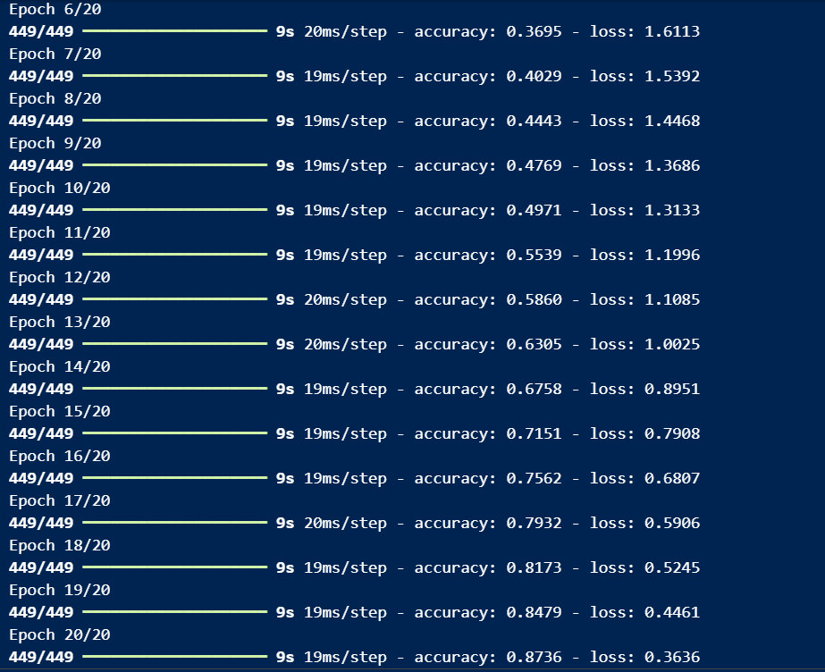
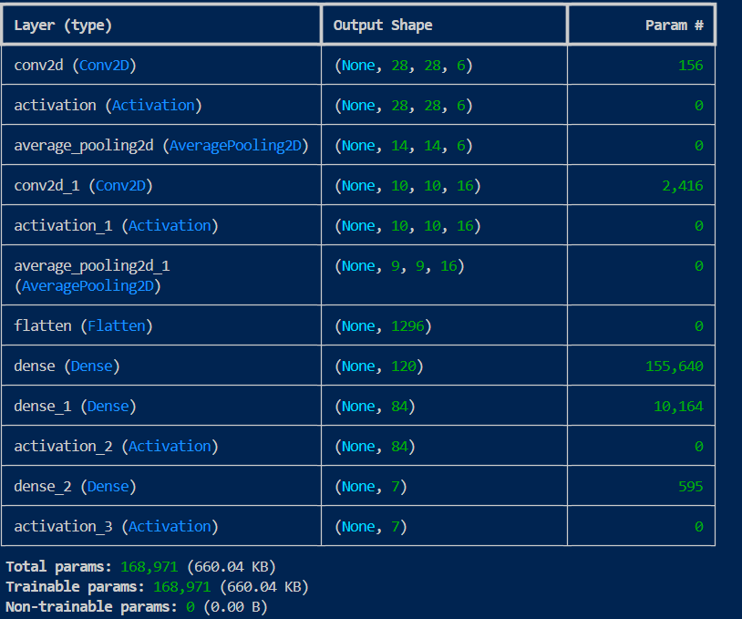

# Face Emotion Recognition Using CNNs

This project is a facial emotion recognition system that uses convolutional neural networks (CNNs) to classify emotions based on images from the FER-2013 dataset. I experimented with two architectures: a basic CNN model and the LeNet architecture, and compared their performance.

## Project Overview

Facial emotion recognition can help improve human-computer interaction by enabling machines to better understand and respond to human emotions. This project focuses on using CNN architectures to classify facial expressions into different categories.

## Dataset

The dataset used for training and testing is the [FER-2013 dataset](https://www.kaggle.com/datasets/msambare/fer2013), which contains grayscale images of faces with seven emotion labels: 
- Angry
- Disgust
- Fear
- Happy
- Sad
- Surprise
- Neutral

## Models Used

### Basic CNN Architecture
The basic CNN model was trained with the following results:
- **Training Accuracy:** 87.36%
- **Training Loss:** 0.3636
- **Testing Accuracy:** 67.42%
- **Testing Loss:** Not recorded




### LeNet Architecture
The LeNet model, originally designed for digit recognition, was adapted for this task. The results were as follows:
- **Training Accuracy:** 70.52%
- **Training Loss:** 0.8036
- **Testing Accuracy:** 46.90%
- **Testing Loss:** 1.6407




## Performance Comparison

| Model       | Training Accuracy | Training Loss | Testing Accuracy | Testing Loss |
|-------------|-------------------|---------------|------------------|--------------|
| Basic CNN   | 87.36%            | 0.3636        | 67.42%           | -            |
| LeNet       | 70.52%            | 0.8036        | 46.90%           | 1.6407       |

The basic CNN model outperformed the LeNet model, indicating that a more tailored CNN architecture can better capture the complexities of facial emotions in this dataset.

## Conclusion

This project demonstrated that a basic CNN model can provide higher accuracy on the FER-2013 dataset for facial emotion recognition than the classic LeNet architecture. Further improvements could include experimenting with deeper networks, data augmentation, or advanced techniques like transfer learning.

## How to Run the Project

1. Clone this repository:
   ```bash
   git clone https://github.com/yourusername/face-emotion-recognition.git
